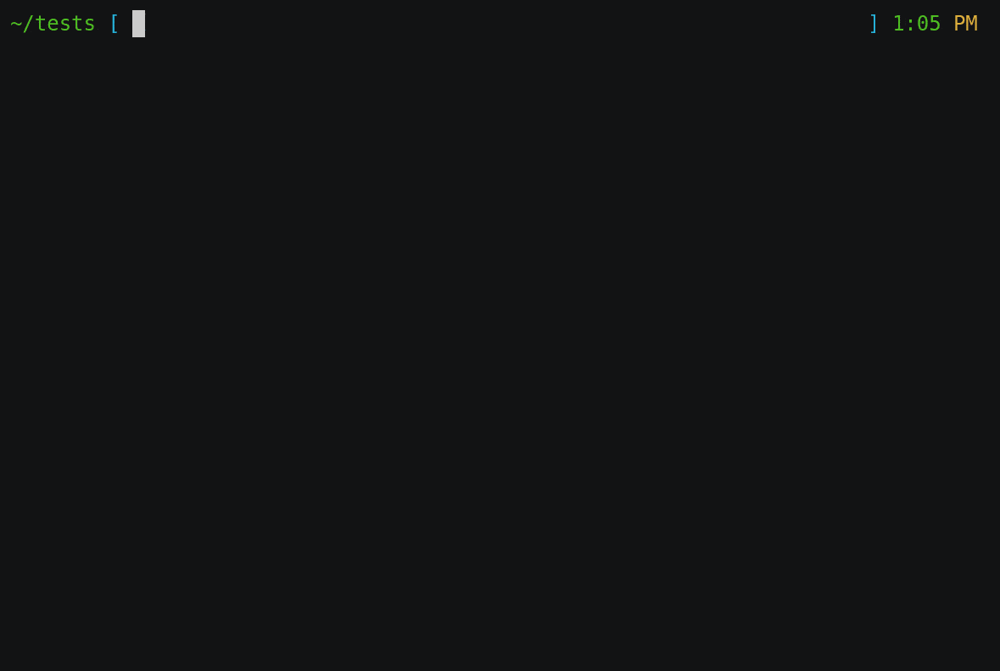

# Bazzar

A tiny and comfy CLI written in Go to interact with [Malware Bazzar](https://bazaar.abuse.ch/) samples and [Urlhaus](https://urlhaus.abuse.ch/) database.

## Why

I really enjoy navigate and use abuse.ch services when I'm doing any kind of threat research or malware analysis, and I always wanted a simple CLI tool to use their services just to pick some useful attributes of a malware or url, that's why I built this simple yet useful tool.

## Features

With bazzar you can:

* Query sample info in raw text and json format
* Query url info in raw text and json format
* Download any malware sample available in Malware Bazzar

## Usage:

<pre>
Interact with abuse.ch intel feed

Usage:
  bazzar [command]

Available Commands:
  help        Help about any command
  sample      Interact with samples in Malware Bazzar
  url         Query urlhaus information

Flags:
  -h, --help   help for bazzar

Use "bazzar [command] --help" for more information about a command.
</pre>

Right now you can interact with the sample subcommand and the url subcommand

### Sample subcommand
<pre>
Usage:
  bazzar sample [flags] sha256

Flags:
  -h, --help            help for sample
  -i, --info            Get sample info
  -j, --json            Output info in json format
  -l, --list-last       List last 100 entries in Malware Bazzar
  -o, --output string   Output sample path

You need to pass at least the sample hash, but you can normally list
</pre>

### URL subcommand
<pre>
Usage:
  bazzar url url|host [flags]

Flags:
  -h, --help         help for url
  -j, --json         Output in JSON format
  -l, --list         List new urls
  -n, --num int      Number of urls to list (default 20)
  -u, --url string   Get URL information

You need to pass a url or host, but you can normally list
</pre>

## Example 

### Sample interaction

### URL interaction

# Installing

## Using go (best way):tm
<pre>
$ go get github.com/aandersonl/bazzar
</pre>

This will download and compile everything in your GOPATH, make sure to have ***$GOPATH/bin*** in your path in order to work.

## Releases:

You can also go to [releases](https://github.com/AandersonL/bazzar/releases) and grab the latest version avaiable.

## Roadmap

As this is not a finish tool, I will soon add other features like:

* Query samples by tag
* Query by imphash,tlsh,ssdeep (This queries don't work in the current api spec)
* Download daily generated samples batch
* Correlate samples with urlhaus
* Generate MISP events

Thanks.
